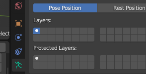
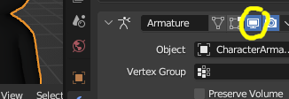

# Land Speed Analyzer
Add-on for Blender

Prevent foot sliding ("moonwalking") in your game by analyzing the foot speed (while touching ground) in Blender &amp; using the value in your game!

When you make animated characters, typically the character is running, walking, etc. in place. This add-on recovers the land speed based upon the foot speed of the foot name you enter.

## How to use add-on
- Set the Z MAX to the highest world Z coordinate your foot bone's tail (small end) while on the ground (so that lifted foot frames can be ignored).
  - Frames moving the opposite direction of the selected direction are ignored automatically (lift is assumed).
    - For a walking backwards animation, or if your character faces toward positive Y, be sure to change the direction setting to match.
- If you have changed defaults,
  - you must choose "Pose Position" in the Armature object's "Data" tab

  - and similar pose features such as the Armature modifier to ensure this add-on can read your poses.

- This add-on has only been tested on "actions" in the NLA. In other cases if the land speed is not found please report an issue at <https://github.com/Hierosoft/land_speed_analyzer/issues> and provide an example file.
- If your feet do not move at a constant rate, you will still have the problem at different parts of your animation that do not match the average. To fix the sliding issue entirely in that case you will have to make foot motion linear while on the ground.

### How to use in game
- In your game code, add the land_speed but be sure to also scale it by the scale of the character (technically the y scale; if not 1.0) in your 3D/game engine.

For details on how this all works and why, see my article [Why Game Characters Moonwalk–How to Prevent Foot Sliding](https://poikilos.org/2019/05/02/why-game-characters-moonwalk-how-to-prevent-foot-sliding/).
